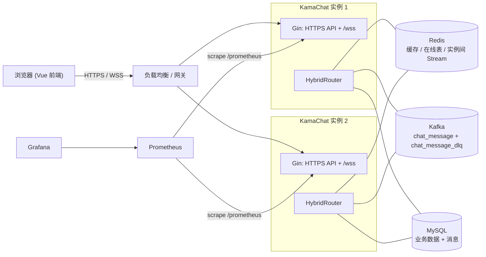
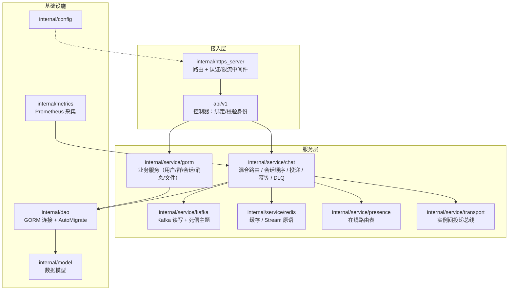
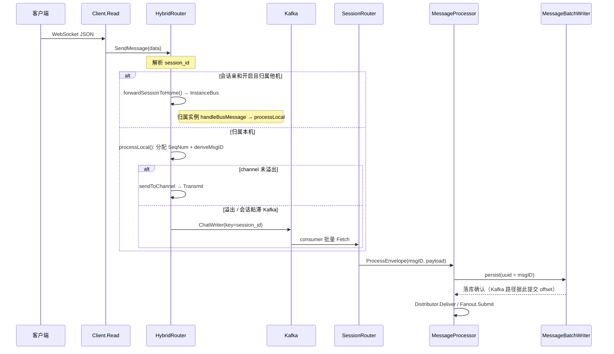
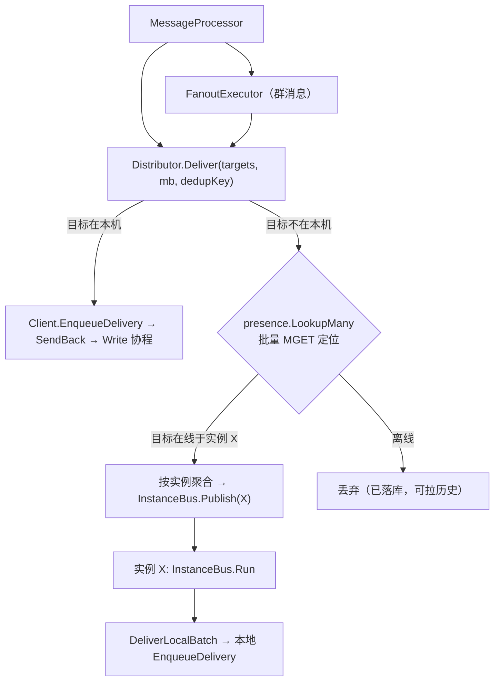
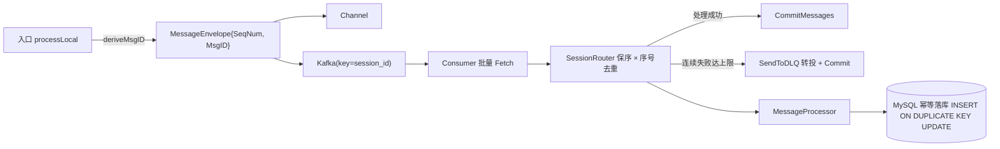

# KamaChat 架构总览

> 本文档给出系统的**整体架构图与关键链路**，作为代码阅读与面试讲解的地图。各专题细节见 [README.md](README.md) 索引。

## 1. 系统上下文与部署拓扑

单实例即可运行；开启 `clusterConfig.enabled` 后支持多实例水平扩展：实例间通过 Redis 在线路由表定位用户、通过 Redis Stream 互相投递。



## 2. 代码分层与组件职责



| 组件 | 关键文件 | 职责 |
| --- | --- | --- |
| 接入/路由 | `internal/https_server/https_server.go` | Gin 路由、CORS、TLS、认证与限流中间件、`/metrics` + `/prometheus` |
| 控制器 | `api/v1/*.go` | 绑定请求、从 JWT 取身份、调用服务层、统一响应 |
| 混合路由 | `chat/hybrid_router.go` | `SendMessage` / `processLocal`：分配序号、生成幂等 ID、channel↔Kafka 分流、会话亲和转发、DLQ 消费循环 |
| 背压 | `chat/backpressure_detector.go` | 采样 channel 深度，持续高水位触发溢出 |
| 会话顺序 | `chat/session_router.go` | 每会话独立队列 + 序号缓冲，保证会话内 FIFO |
| 消息处理 | `chat/message_processor.go` | 文本/文件/音视频落库、单聊/群聊投递、缓存更新 |
| 批量落库 | `chat/message_batch.go` | 攒批 INSERT（默认 50 条 / 10ms），`ON CONFLICT DO NOTHING` 幂等 |
| 群扇出 | `chat/fanout_executor.go` | 8 worker 按群哈希分片，同群串行保序 |
| 投递分发 | `chat/distributor.go` | 本地优先直投；异地按实例聚合转发；接收端 TTL 去重 |
| 会话亲和 | `chat/session_ring.go` | 一致性哈希环，会话→实例稳定映射 |
| 在线路由 | `presence/presence.go` | `presence:user:<uuid>` 注册/查/批量定位 + 实例注册表 |
| 实例间总线 | `transport/instance_bus.go` | 每实例一条 Redis Stream，消费组 + XACK + pending 重投 |
| Kafka | `kafka/kafka_service.go` | ChatWriter/Reader + DLQ Writer，单副本（开发环境） |
| 指标 | `metrics/metrics.go` | Prometheus 采集（复用 `chat.ChatMetrics`）+ Go/进程指标 |

## 3. 消息发送路径（入口 → 路由 → 会话队列 → 处理）



- **channel 路径**：延迟最低，`Transmit` 满时 `select+default` 立即分流 Kafka（发送方不阻塞）。
- **Kafka 路径**：以 `session_id` 为 key 保分区顺序；手动提交 offset，落库成功才提交。
- **会话粘滞**：会话一旦进入 Kafka，恢复前始终走 Kafka，避免两条链路并存乱序。

## 4. 实时投递路径（本地优先 + 跨实例 + 会话亲和）



- **本机快路径**：命中内存 `map[uuid]*Client`，无额外 Redis 往返。
- **群扇出收敛**：远程成员按实例聚合，发布次数由 O(成员数) → O(实例数)。
- **会话亲和**：SessionRing 把同一会话固定到某实例处理（序号单点生成），跨实例会话因此仍严格有序。

## 5. 消息可靠性链路（不重复 / 不阻塞 / 不丢）



- **幂等**：入口生成稳定 `MsgID`（客户端 `client_msg_id` 派生）；落库以 `message.uuid` 唯一索引 + `ON DUPLICATE KEY UPDATE` 去重 → 重放/重试不产生重复行、不再整批失败。
- **死信**：同一批连续失败达 `maxProcessRetries` 后转投 `chat_message_dlq` 并提交 offset，避免毒消息阻塞分区；转投失败则不提交、继续重试。

## 6. 可观测性

- `/prometheus`：Prometheus 文本指标（路由/可靠性/批量/分布式/限流 + Go runtime/进程）。
- `/metrics`：JSON 计数器，兼容压测工具 `ws_load.go`。
- `:8091/debug/pprof/`：goroutine/heap/CPU 剖析。
- `docker compose` 内置 Prometheus + Grafana 与预置看板「KamaChat 概览」。

## 7. 关键配置开关

| 配置 | 默认 | 作用 |
| --- | --- | --- |
| `kafkaConfig.messageMode` | `hybrid` | `channel` / `kafka` / `hybrid` 三种消息模式 |
| `constants.CHANNEL_SIZE` | 4096 | 路由 channel 容量与背压阈值基数 |
| `kafkaConfig.dlqTopic` / `maxProcessRetries` | `chat_message_dlq` / 5 | 死信主题与重试上限 |
| `clusterConfig.enabled` | false | 开启分布式多实例投递 |
| `clusterConfig.sessionAffinity` | false | 会话亲和（跨实例单会话有序） |
| 环境变量 | — | `KAMA_*` 覆盖（见根 [README](../README.md)） |

## 8. 目录 → 职责速查

```
cmd/kama_chat_server/      入口：初始化 DB/路由/WS/pprof，优雅关闭
api/v1/                    HTTP 控制器
internal/https_server/     Gin 路由 + 中间件（认证 / 限流）
internal/metrics/          Prometheus 采集
internal/service/chat/     混合路由、会话、投递、幂等、DLQ
internal/service/gorm/     业务服务层
internal/service/kafka/    Kafka 读写 + 死信主题
internal/service/redis/    缓存 / Stream 原语
internal/service/presence/ 在线路由表
internal/service/transport/实例间投递总线
internal/dao, internal/model, internal/config
pkg/                       公共工具（auth / zlog / ssl / enum ...）
test/                      性能与集成测试
deploy/                    Prometheus / Grafana 配置
web/chat-server/           Vue 前端
```
